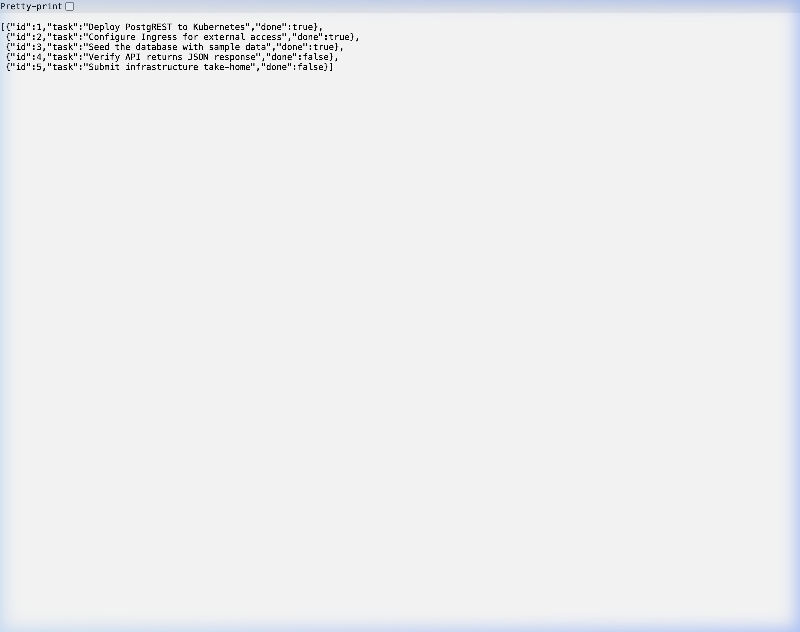

# Infrastructure Take Home

Treat this system as a production system.

## Getting Started

Clone this repository locally.
Create your own public git repository in github or somewhere we can access and push this code into it.
Make changes to your repository.
Getting things to work for you is part of the assessment.

You will be assessed by someone cloning your repository when you're finished and running your instructions to recreate the expected solution.
If we cannot run your repository instructions we cannot assess your work.

### Prerequsites

You will need the following:
* docker runtime and tools
* k3d CLI
* opentofu binary or terraform
* kubectl binary
* git

## Starting point

Use terraform or opentofu to initialise a k3d cluster and postgres instance locally from the `tofu` directory.
Install Argo CD into the k3d cluster by following the instructions in the `argocd` directory.

---

## Setup Instructions

Follow these steps in order to bring up the full stack.

### 1. Create the k3d cluster, Postgres, and database resources

```bash
cd tofu
tofu init
tofu apply -auto-approve
```

This will:
- Create a k3d cluster named `infra-takehome` with port 8080 mapped to the loadbalancer
- Start a Postgres 16 container attached to the k3d Docker network
- Create the `postgrest` database
- Create database roles: `app_admin` (superuser), `authenticator`, and `web_anon`
- Create the `postgrest` Kubernetes namespace
- Inject the `postgrest-secrets` Secret containing `PGRST_DB_URI`

### 2. Install Argo CD (optional)

```bash
kubectl create namespace argocd
kubectl apply --server-side -k argocd/
```

### 3. Deploy PostgREST

```bash
kubectl apply -f k8s/postgrest/deployment.yaml
kubectl apply -f k8s/postgrest/service.yaml
kubectl apply -f k8s/postgrest/ingress.yaml
```

Wait for the PostgREST pod to be ready:

```bash
kubectl -n postgrest wait --for=condition=ready pod -l app=postgrest --timeout=120s
```

### 4. Seed the database

```bash
kubectl apply -f k8s/postgrest/seed-job.yaml
```

Wait for the seed job to complete:

```bash
kubectl -n postgrest wait --for=condition=complete job/seed-data --timeout=60s
```

### 5. Verify

Open your browser to [http://localhost:8080/todos](http://localhost:8080/todos) to see the seeded data.

Or use curl:

```bash
curl -s http://localhost:8080/todos | jq .
```

---

## Expected Output

When you visit `http://localhost:8080/todos` in your browser, you should see something like:

```json
[
  {"id":1,"task":"Deploy PostgREST to Kubernetes","done":true},
  {"id":2,"task":"Configure Ingress for external access","done":true},
  {"id":3,"task":"Seed the database with sample data","done":true},
  {"id":4,"task":"Verify API returns JSON response","done":false},
  {"id":5,"task":"Submit infrastructure take-home","done":false}
]
```



---

# Problem

Please add commits to your fork of the repo to answer this problem.
Note: the use of the word `postgrest` is confusing, but correct - this is a project that we're going to deploy.

## Add a user to the database

Please add a super user to the postgrest database.

## Inject a secret for postgrest

Creating a superuser account in this new database, inject the secrets into the k3d cluster into a namespace called postgrest.
You must do this with terraform/opentofu.

## Install Postgrest into the k3d cluster

https://docs.postgrest.org/en/v14/

The result should be an accessible endpoint that you can use in your browser.

## Inject some data from the cluster using a `Job`

Use a kubernetes job to inject some data into the postgres database

## Provide an expected screenshot

Update this file, README.md, with a screenshot of what we should see when we visit the URL after following your instructions - this should show us the data you have injected.

---

## Architecture

```
Browser (:8080)
    │
    ▼
k3d LoadBalancer (port 8080 → 80)
    │
    ▼
Traefik Ingress Controller
    │
    ▼
PostgREST Service (ClusterIP :3000)
    │
    ▼
PostgREST Pod
    │  PGRST_DB_URI from K8s Secret
    ▼
Postgres Container (postgres-infra-takehome:5432)
    │  on k3d Docker network
    ▼
postgrest database
    └── public.todos table
```

## Teardown

```bash
cd tofu
tofu destroy -auto-approve
```
